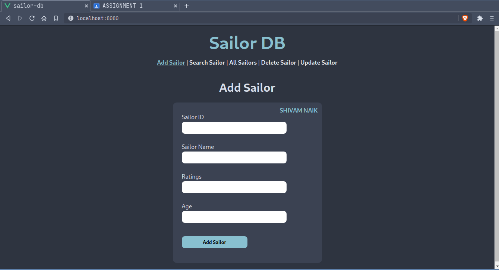
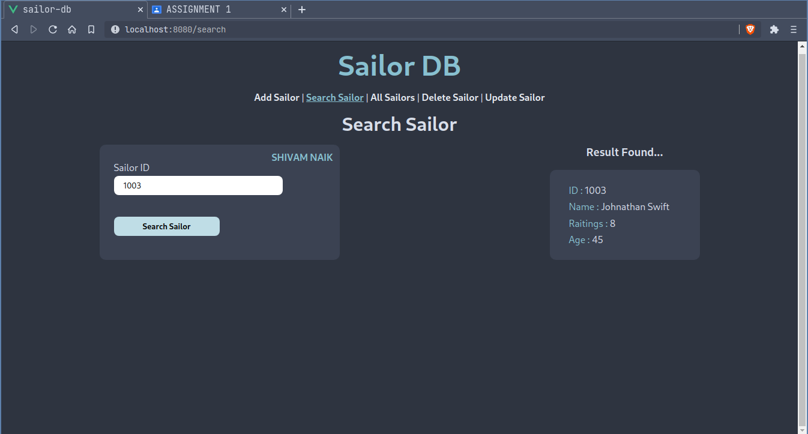
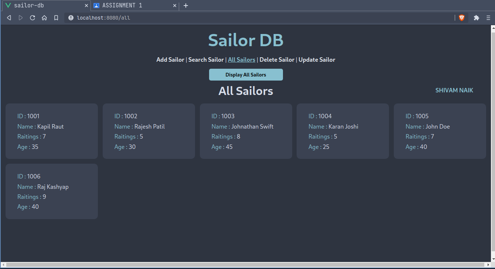
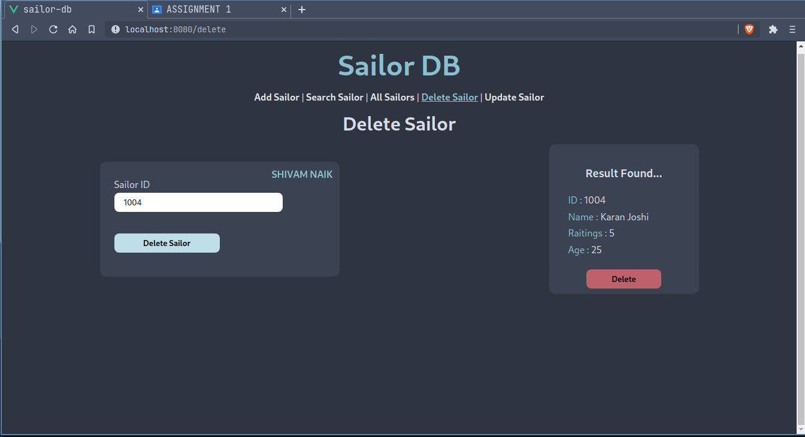
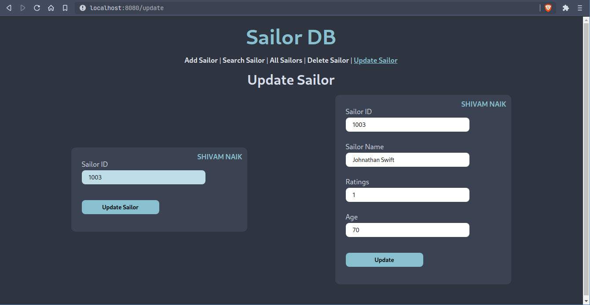

# Sailor_DB

A simple web application for performing CRUD operations on a sailor's database. Built as an Assignment for DBMS subject.

<br />

## Install

<br />

### Server

```bash
$ cd server

$ npm install
```

### Client

```bash
$ cd client

$ npm install
```

<br />

## Run & Start

<br />

### Server

```bash
$ cd server

$ npm run start
```

### Client

```bash
$ cd client

$ npm run serve
```

<br />

## Screenshots

<br />

### Add Sailor

<br /><br />

### Search Sailor

<br /><br />

### Display All Sailors

<br /><br />

### Delete Sailor

<br /><br />

### Update Sailor


